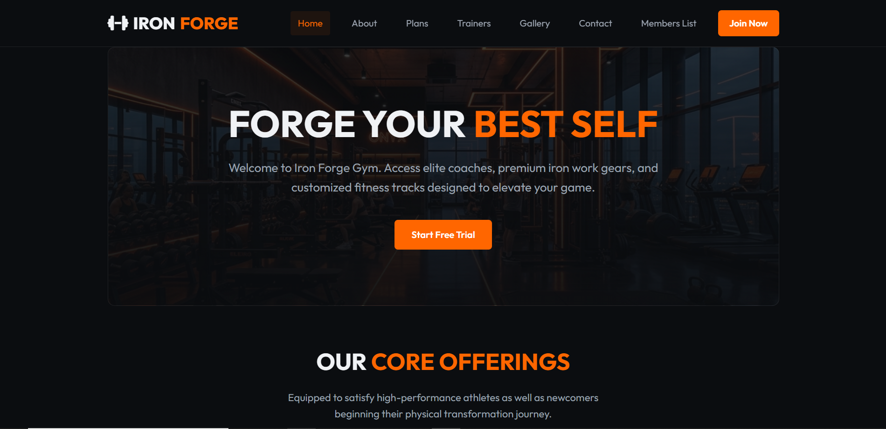
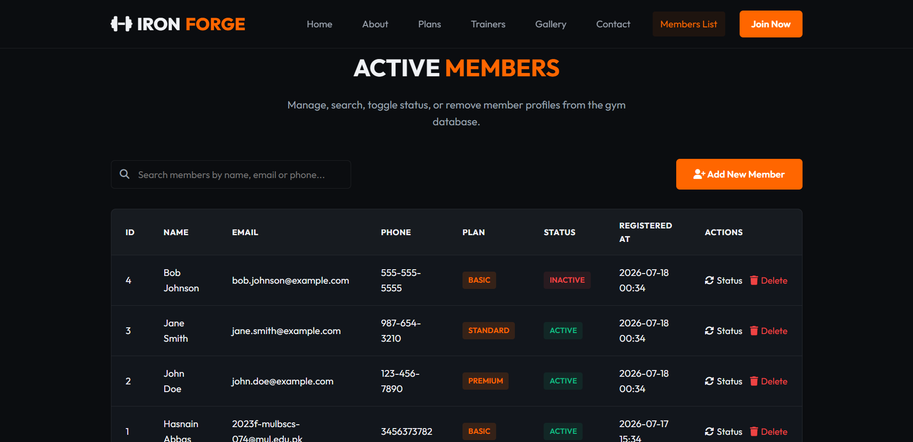
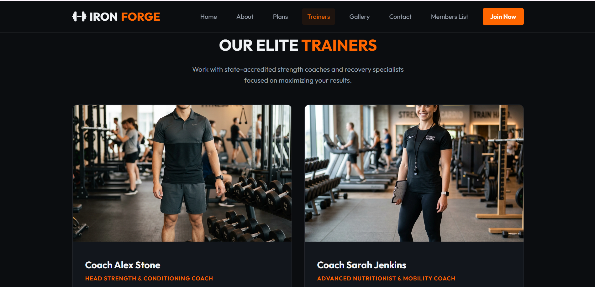

# 🏋️‍♂️ IRON-FORGE: Gym Membership Management System

[](https://www.php.net/)
[](https://www.mysql.com/)
[](https://developer.mozilla.org/en-US/)
[](https://jquery.com/)

A robust, full-stack web application designed to transition traditional manual fitness club registries into a seamless, automated digital management system. This project features a secure administrative CRUD portal alongside dynamic AJAX-based client-side searching and a fully responsive public informational presentation layer.

---

## 📸 Interface Previews

### 1. Home / Hero Showcase


### 2. Admin Management Panel & Live Filters


### 3. Our Elite Trainers Section


---

## 🚀 Key Modules & Architecture

### 1. Administrative / Management Portal (Members CRUD)
* **Create:** Secure member registration capturing vital profile parameters.
* **Read/View:** Complete data grids displaying all currently active gym members.
* **Update/Delete:** Seamless editing capabilities for lifecycle updates and active member offboarding.

### 2. Dynamic Search Engine
* Integrated a real-time **live search filtering module** powered by jQuery. Users can look up members instantly by Name or Email without initiating any heavy page-refreshes (Asynchronous processing).

### 3. Public Informational Interface
Fully responsive consumer-facing static landing sections built using custom layouts:
* **Home / Hero Showcase**
* **About Us & Training Philosophy**
* **Membership Plans & Subscription Tiers**
* **Trainer Profiles & Dynamic Gallery**
* **Contact Gateway**

---

## 📊 Database Architecture

The system utilizes a lightweight, optimized relational structure inside a single main table designed for low-latency operations.

### `members` Table Schema
| Column Name | Data Type | Key Type | Description |
| :--- | :--- | :--- | :--- |
| `id` | INT | PRIMARY KEY (AUTO_INCREMENT) | Unique identification index for each member. |
| `name` | VARCHAR(100) | - | Full legal name of the registered subscriber. |
| `email` | VARCHAR(100) | UNIQUE | Validated electronic mail address. |
| `phone` | VARCHAR(20) | - | Active contact number for communications. |
| `plan` | VARCHAR(50) | - | Selected package (e.g., Basic, Standard, Premium). |
| `status` | VARCHAR(20) | DEFAULT 'Active' | Current subscription state of the gym member. |
| `created_at` | TIMESTAMP | - | Auto-generated timestamp recording registration date. |

---

## 🛠️ Tech Stack & Technical Specifications

* **Frontend Layers:** HTML5, CSS3 (Custom Responsive Grid System), Vanilla Modern JavaScript (ES6+).
* **Client Interactivity:** jQuery (Form validation engine & Asynchronous DOM manipulators).
* **Backend Processing Engine:** Structural PHP (Server-side routing, request handling, and relational mappings).
* **Database Management:** MySQL Server.
* **Local Development Environment:** Apache Web Server hosted via XAMPP.

---

## ⚙️ Installation & Local Setup Instructions

Follow these step-by-step instructions to deploy this project locally on your machine using **XAMPP**:

### Prerequisites
* Ensure you have the latest version of [XAMPP](https://www.apachefriends.org/) installed with PHP 8.x support.

### Step-by-Step Deployment

1. **Extract Project Directory:**
   Move or clone the project folder into your XAMPP server root:
   ```bash
   C:\xampp\htdocs\gym_membership\
